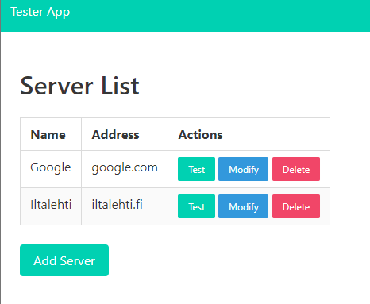
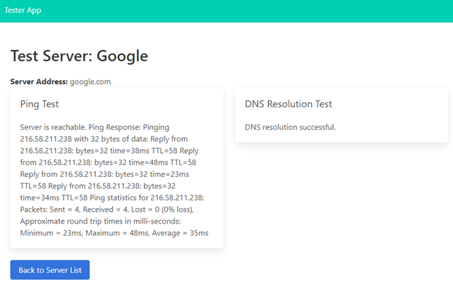
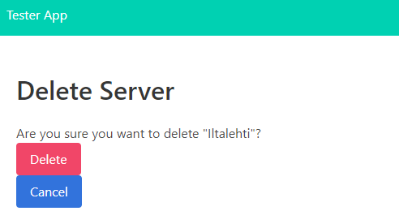

# AI Tools Django app

This repository is for HAMK AI Tools course, Django Web App assignment. All coding is made by AI, except edits to settings.py, although that could have been done as well.

Below is the conversation between user and ChatGPT 3.5

## Conversation

**Tool**: ChatGPT3.5

**Prompt**: write me a django app called Tester, with the purpose of testing reachability of a list of servers over the internet. create the models.py and views.py. use bulma css for the view templates.

**Result**:
To create a Django app called "Tester" for testing the reachability of a list of servers over the internet, you can follow these steps:

Create a Django project (if you don't have one already):
```
django-admin startproject tester_project
cd tester_project
```

Create a Django app named "tester":
```
python manage.py startapp tester
```

Install the Bulma CSS framework:
You can include Bulma by either downloading it manually or using a CDN. For simplicity, we'll use a CDN in this example.

In your project's base.html file (usually located in your project's templates directory), add the following line within the <head> section to include the Bulma CSS:
```
<link rel="stylesheet" href="https://cdn.jsdelivr.net/npm/bulma@0.9.2/css/bulma.min.css">
```

Define the models in models.py of the "tester" app:
```
# tester/models.py
from django.db import models

class Server(models.Model):
    name = models.CharField(max_length=100)
    address = models.CharField(max_length=100)

    def __str__(self):
        return self.name
```

Create a form for adding servers in forms.py:
```
# tester/forms.py
from django import forms
from .models import Server

class ServerForm(forms.ModelForm):
    class Meta:
        model = Server
        fields = ['name', 'address']
```

Create views in views.py:
```
# tester/views.py
from django.shortcuts import render, redirect
from .models import Server
from .forms import ServerForm
import socket

def server_list(request):
    servers = Server.objects.all()
    return render(request, 'tester/server_list.html', {'servers': servers})

def add_server(request):
    if request.method == 'POST':
        form = ServerForm(request.POST)
        if form.is_valid():
            form.save()
            return redirect('server_list')
    else:
        form = ServerForm()
    return render(request, 'tester/add_server.html', {'form': form})

def test_server(request, server_id):
    try:
        server = Server.objects.get(pk=server_id)
        result = socket.gethostbyname(server.address)
    except Server.DoesNotExist:
        result = "Server not found"
    except socket.gaierror:
        result = "Could not resolve host"
    
    return render(request, 'tester/test_server.html', {'server': server, 'result': result})
```

Create templates in a "tester" directory within your app's templates directory:
tester/templates/tester/server_list.html:
```


  <h1 class="title">Server List</h1>
  <ul>
    
      <li><a href="">{{ server.name }}</a></li>
    
  </ul>
  <a href="" class="button is-primary">Add Server</a>

```

tester/templates/tester/add_server.html:
```


  <h1 class="title">Add Server</h1>
  <form method="post">
    
    {{ form.as_p }}
    <button type="submit" class="button is-primary">Save</button>
  </form>
  <a href="" class="button is-link">Back to Server List</a>

```

tester/templates/tester/test_server.html:
```


  <h1 class="title">Test Server: {{ server.name }}</h1>
  <p>Server Address: {{ server.address }}</p>
  <p>Test Result: {{ result }}</p>
  <a href="" class="button is-link">Back to Server List</a>

```

Update your project's urls.py:
```
# tester_project/urls.py
from django.contrib import admin
from django.urls import path, include

urlpatterns = [
    path('admin/', admin.site.urls),
    path('tester/', include('tester.urls')),
]
```

Create a urls.py file in your "tester" app:
```
# tester/urls.py
from django.urls import path
from . import views

urlpatterns = [
    path('', views.server_list, name='server_list'),
    path('add/', views.add_server, name='add_server'),
    path('test/<int:server_id>/', views.test_server, name='test_server'),
]
```

Run migrations and start the development server:
```
python manage.py makemigrations
python manage.py migrate
python manage.py runserver
```

Now, you have a Django app named "Tester" that allows you to add and test the reachability of servers over the internet using Bulma CSS for styling. Access the app at http://localhost:8000/tester/.

**Prompt**: generate a base.html file for the app as well. also create the admin.py.

**Result**:
Certainly! Here's a base.html file for your Django app named "Tester" along with the admin.py for the app:

base.html for your app's templates (usually located in the templates directory of your app):
```
<!DOCTYPE html>
<html lang="en">
<head>
    <meta charset="UTF-8">
    <meta name="viewport" content="width=device-width, initial-scale=1.0">
    <title>Tester App</title>
    <link rel="stylesheet" href="https://cdn.jsdelivr.net/npm/bulma@0.9.2/css/bulma.min.css">
</head>
<body>
    <nav class="navbar is-primary" role="navigation" aria-label="main navigation">
        <div class="navbar-brand">
            <a class="navbar-item" href="">
                Tester App
            </a>
        </div>
        <div class="navbar-menu">
            <div class="navbar-end">
                <a class="navbar-item" href="">
                    Server List
                </a>
                <a class="navbar-item" href="">
                    Add Server
                </a>
            </div>
        </div>
    </nav>
    
    <section class="section">
        <div class="container">
            
            
        </div>
    </section>
</body>
</html>
```
This base.html file provides a basic structure with navigation links for your app using Bulma CSS.

Create admin.py for the "tester" app:
```
# tester/admin.py
from django.contrib import admin
from .models import Server

@admin.register(Server)
class ServerAdmin(admin.ModelAdmin):
    list_display = ('name', 'address')
```

Now, your "Tester" app has an admin.py file configured to display the Server model in the Django admin panel. You can manage servers through the admin interface.

**Prompt**: tidy app the views with columns and tables, use bulma css for the inputs as well, leave some margin between the elements and add a modify and delete for the servers. Also change the test so that it tests a ping test as well as resolver.

**Result**:
To enhance the views in your "Tester" app using Bulma CSS and add modify and delete options for servers, you can make the following changes:

Update server_list.html:
```


  <h1 class="title">Server List</h1>
  <table class="table is-bordered is-striped is-hoverable">
    <thead>
      <tr>
        <th>Name</th>
        <th>Address</th>
        <th>Actions</th>
      </tr>
    </thead>
    <tbody>
      
        <tr>
          <td>{{ server.name }}</td>
          <td>{{ server.address }}</td>
          <td>
            <a href="" class="button is-primary is-small">Test</a>
            <a href="" class="button is-info is-small">Modify</a>
            <a href="" class="button is-danger is-small">Delete</a>
          </td>
        </tr>
      
    </tbody>
  </table>
  <a href="" class="button is-primary">Add Server</a>

```

Update add_server.html:
```


  <h1 class="title">Add Server</h1>
  <form method="post" class="form">
    
    <div class="field">
      <label class="label">Name</label>
      <div class="control">
        {{ form.name }}
      </div>
    </div>
    <div class="field">
      <label class="label">Address</label>
      <div class="control">
        {{ form.address }}
      </div>
    </div>
    <div class="field">
      <div class="control">
        <button type="submit" class="button is-primary">Save</button>
      </div>
    </div>
  </form>
  <a href="" class="button is-link">Back to Server List</a>

```

Update test_server view in views.py to include a ping test:
```
# tester/views.py
import socket
import subprocess

def test_server(request, server_id):
    try:
        server = Server.objects.get(pk=server_id)
        ip_address = socket.gethostbyname(server.address)
        
        # Perform a ping test
        try:
            ping_result = subprocess.run(
                ["ping", "-c", "3", ip_address],
                stdout=subprocess.PIPE,
                stderr=subprocess.PIPE,
                text=True,
                timeout=10,
            )
            if ping_result.returncode == 0:
                result = f"Server is reachable. Ping Response: {ping_result.stdout}"
            else:
                result = f"Server is unreachable. Ping Error: {ping_result.stderr}"
        except subprocess.TimeoutExpired:
            result = "Ping test timeout. Server may be unreachable."
        
        # Perform a DNS resolution test
        try:
            socket.gethostbyname(server.address)
            dns_result = "DNS resolution successful."
        except socket.gaierror:
            dns_result = "DNS resolution failed. Could not resolve host."

    except Server.DoesNotExist:
        result = "Server not found"
        dns_result = ""
    
    return render(
        request,
        'tester/test_server.html',
        {'server': server, 'ping_result': result, 'dns_result': dns_result}
    )
```

Update urls.py to include new URLs for modifying and deleting servers:
```
# tester/urls.py
urlpatterns = [
    path('', views.server_list, name='server_list'),
    path('add/', views.add_server, name='add_server'),
    path('test/<int:server_id>/', views.test_server, name='test_server'),
    path('modify/<int:server_id>/', views.modify_server, name='modify_server'),
    path('delete/<int:server_id>/', views.delete_server, name='delete_server'),
]
```

Create views for modifying and deleting servers in views.py:
```
# tester/views.py
from django.shortcuts import get_object_or_404, redirect

def modify_server(request, server_id):
    server = get_object_or_404(Server, pk=server_id)

    if request.method == 'POST':
        form = ServerForm(request.POST, instance=server)
        if form.is_valid():
            form.save()
            return redirect('server_list')
    else:
        form = ServerForm(instance=server)

    return render(request, 'tester/modify_server.html', {'form': form, 'server': server})

def delete_server(request, server_id):
    server = get_object_or_404(Server, pk=server_id)
    
    if request.method == 'POST':
        server.delete()
        return redirect('server_list')
    
    return render(request, 'tester/delete_server.html', {'server': server})
```

Create corresponding HTML templates for modifying and deleting servers:
modify_server.html:
```


  <h1 class="title">Modify Server</h1>
  <form method="post" class="form">
    
    {{ form.as_p }}
    <button type="submit" class="button is-primary">Save</button>
  </form>
  <a href="" class="button is-link">Back to Server List</a>

```

delete_server.html:
```


  <h1 class="title">Delete Server</h1>
  <p>Are you sure you want to delete "{{ server.name }}"?</p>
  <form method="post" class="form">
    
    <button type="submit" class="button is-danger">Delete</button>
  </form>
  <a href="" class="button is-link">Cancel</a>

```

Now, your "Tester" app's views are improved with columns, tables, Bulma CSS styling, and options to modify and delete servers. The test_server view also includes both ping and DNS resolution tests.

**Prompt**: update the test_server page as well

**Result**:
Certainly! To update the test_server page with the ping and DNS resolution test results, you can modify the test_server.html template as follows:
```


  <h1 class="title">Test Server: {{ server.name }}</h1>
  <p><strong>Server Address:</strong> {{ server.address }}</p>
  
  <div class="columns">
    <div class="column">
      <div class="box">
        <h2 class="subtitle">Ping Test</h2>
        <p>{{ ping_result }}</p>
      </div>
    </div>
    <div class="column">
      <div class="box">
        <h2 class="subtitle">DNS Resolution Test</h2>
        <p>{{ dns_result }}</p>
      </div>
    </div>
  </div>

  <a href="" class="button is-link">Back to Server List</a>

```

This updated template divides the test results into two columns, one for the Ping Test and the other for the DNS Resolution Test, making it more organized and visually appealing.


## Comments
The code is working and quite neat. Simple solutions can very well be made with ChatGPT, but the user needs to check and alter the code where necessary. For example the Ping test requires admin privileges, but removing the -c option fixes this. Also you need to be very careful when updating files, the generated code includes only the requested additions, not always the whole code.

## Screenshots



